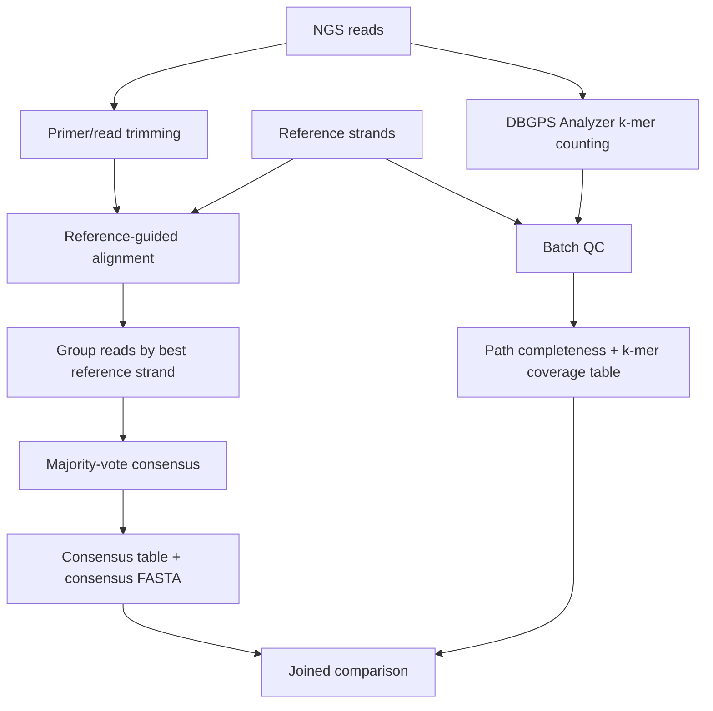

# Alignment Consensus vs DBGPS Analyzer Analysis

This folder contains a reproducible workflow for comparing a conventional
sequence-alignment plus majority-vote consensus pipeline against DBGPS Analyzer.

The comparison is designed to answer two questions:

1. How fast is DBGPS Analyzer's k-mer graph-based Batch QC relative to an
   alignment/consensus workflow?
2. Where do the two methods agree or disagree at the strand level?

## Workflow



## Files

- `run_consensus_vs_dbgps.py`  
  Dependency-light analysis runner. It includes a small Needleman-Wunsch global
  aligner for smoke tests and small synthetic datasets.

Generated files are written to `analysis/results/` by default:

- `report.md`: run summary and interpretation guide
- `consensus_table.csv`: per-strand alignment/majority-vote metrics
- `dbgps_batch_table.csv`: per-strand DBGPS Batch QC metrics
- `joined_comparison.csv`: side-by-side result comparison
- `consensus.fa`: reconstructed consensus sequences
- `dbgps_kernel.log`: DBGPS kernel log

## Quick Smoke Test

From the repository root:

```bash
make DBGPS-analyzer
python3 analysis/run_consensus_vs_dbgps.py \
  --reference tests/data/strands.fa \
  --reads tests/data/ngs.fa \
  --k 5 \
  --threads 3 \
  --outdir analysis/results
```

The default `k=5` is chosen for the small bundled fixtures. For real DBGPS
datasets, use the intended k-mer size, usually `--k 31`.

## Production-Scale Alignment Recommendation

The built-in Python aligner is intentionally simple and reproducible, but it is
not intended for large sequencing runs. For real datasets, use a short-read
aligner and keep the same downstream comparison table structure.

Example:

```bash
minimap2 -d reference.mmi reference.fa
minimap2 -ax sr -t 16 reference.mmi reads.trimmed.fastq.gz \
  | samtools sort -@ 4 -o reads.sorted.bam
samtools index reads.sorted.bam
```

Then group reads by primary best alignment and generate per-strand pileups or
MSAs before majority voting. The output should preserve these fields so it can
be joined to DBGPS Batch QC results:

- `strand`
- `read_count`
- `mean_depth`
- `N_count`
- `edit_distance`
- `exact_match`
- `ambiguous`

## Comparison Classes

`joined_comparison.csv` assigns each strand to one class:

- `agreement_recovered`: consensus is exact and DBGPS reports complete path.
- `agreement_missing_or_broken`: consensus is not exact and DBGPS reports incomplete path.
- `consensus_only`: consensus is exact but DBGPS reports incomplete path.
- `dbgps_only`: DBGPS path is complete but consensus is not exact.

Disagreements should be inspected manually. Common causes include primer
trimming differences, k-mer size choice, low-depth but correct majority votes,
alignment ambiguity, indels, and strand entanglement.

## Benchmark Protocol

For publishable speed comparison:

1. Use the same input reads, reference strands, primer trimming, and thread count.
2. Run each method at least three times on the same workstation.
3. Record wall-clock time, CPU time, peak memory, CPU model, RAM, storage type,
   compiler version, and OS.
4. Separate startup/indexing time from per-query or per-batch analysis time when
   possible.
5. Report DBGPS Analyzer both with initial NGS counting and with incremental
   `addFile` counting when evaluating repeated sequencing-file additions.

Suggested benchmark table:

| Dataset | Reads | Strands | Method | Threads | Runtime | Peak RAM | Notes |
|:---|---:|---:|:---|---:|---:|---:|:---|
| [dataset] | [n] | [n] | alignment consensus | [t] | [s] | [GB] | align + vote |
| [dataset] | [n] | [n] | DBGPS Batch QC | [t] | [s] | [GB] | count + batch |
| [dataset] | [n] | [n] | DBGPS addFile | [t] | [s] | [GB] | incremental count |

## Interpretation

The alignment workflow reconstructs base-level consensus sequences, making it
useful for final sequence recovery and edit-distance reporting.

DBGPS Analyzer does not directly emit a corrected consensus sequence. Instead,
it provides fast k-mer graph diagnostics: path completeness, k-mer dropout,
coverage profile, adjacent coverage imbalance, k-mer noise, and cross-strand
entanglement. In practice, DBGPS Analyzer is best used as a rapid screening and
diagnostic layer before or alongside slower consensus reconstruction.
