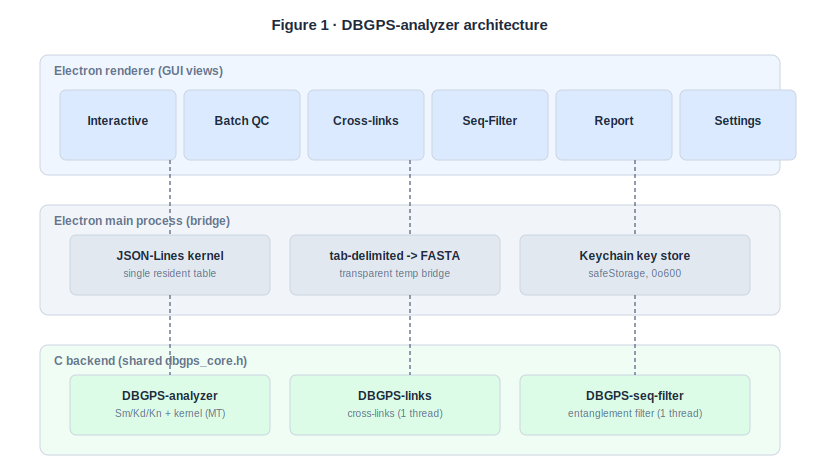
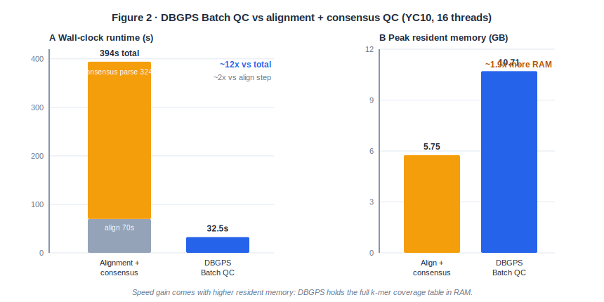
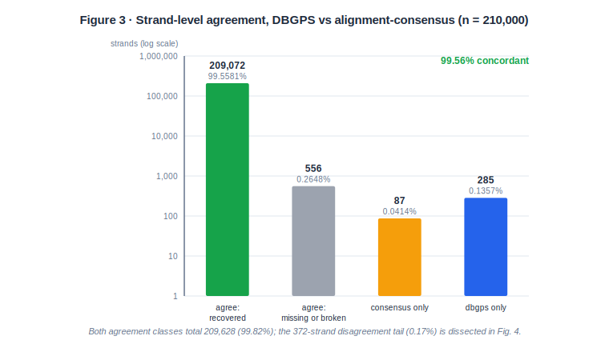
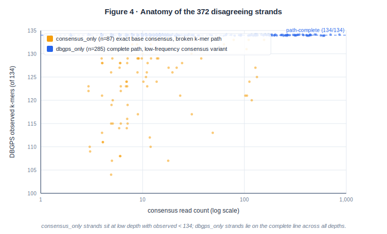

# DBGPS-analyzer: De Bruijn graph-native quality control for DNA data storage pools

*Rapid k-mer path-completeness screening of strand pools, benchmarked against alignment-consensus QC on 210,000 real strands*

**Author:** Lifu Song¹ ✉

¹ *[Affiliation — placeholder]*
✉ Correspondence: *[email — placeholder]*

> **Manuscript status.** Author list, affiliations, and correspondence are placeholders to be completed before submission. This is a software/application paper describing an installable open-source toolkit with a single-run, proof-of-concept real-data validation; it is **not** a new-algorithm methods paper and **not** a finalized multi-run benchmark study. Citations marked `[verify]` must be confirmed against the primary literature before submission.
> **Target venue:** *Bioinformatics* (Oxford University Press), full-length Application/Original Paper, with *GigaScience* or *Bioinformatics Advances* as equivalent fallbacks that can accommodate the full benchmark, GUI figures, and a reproducibility capsule.

---

## Abstract

DNA data storage pipelines need a fast way to ask a single operational question before paying the full cost of base-level decoding: *is this sequenced strand pool decodable?* Current practice answers it with ad-hoc k-mer scripts and spreadsheets, or with a complete alignment-plus-consensus pass whose cost is dominated by consensus calling. We present **DBGPS-analyzer**, an open-source quality-control (QC) toolkit that screens a sequenced pool for decode-readiness directly on the De Bruijn graph. Because the parent DBGPS codec encodes and decodes through a De Bruijn graph, **k-mer path completeness** — every ordered *k*-mer of a target strand being observed in the reads — is a codec-native decode-readiness signal rather than a generic heuristic. The toolkit comprises three C command-line tools over a shared canonical-*k*-mer engine (strand recovery `Sm`, *k*-mer dropout `Kd`, and *k*-mer noise `Kn`; inter-strand cross-link detection; primer-aware entanglement filtering), an interactive JSON-Lines graph kernel that builds the coverage table once and amortizes it across unlimited queries, and an integrated Electron desktop application. On the YC10 dataset (210,000 reference strands of 200 bp; the full, unsubsampled 39,612,583-read FASTQ; 18 + 18 bp primer trimming; *k* = 31; 16 threads), DBGPS Batch QC completed in **32.51 s**, versus **394.024 s** for a standard minimap2-alignment-plus-majority-vote-consensus QC workflow (~12×) and versus the **69.82 s** minimap2 alignment step alone (~2×) — at the explicit cost of higher peak resident memory (**10.706 GB vs 5.755 GB**, ~1.9×) because DBGPS holds the full *k*-mer coverage table in RAM. The two methods measure different quantities yet agree on **99.5581%** of strands. DBGPS-analyzer is a fast graph-level **screening and diagnostic** layer: it does not emit a corrected base-level consensus sequence and is complementary to, never a replacement for, consensus reconstruction. Source code is available under the repository license at <https://github.com/Scilence2022/DBGPS-analyzer>.

**Keywords:** DNA data storage; De Bruijn graph; *k*-mer; quality control; path completeness; strand dropout; sequence entanglement; software tool

---

## 1. Introduction

DNA is an exceptionally dense and durable medium for archival information storage, and a decade of demonstrations has established encode/decode pipelines that write digital data into synthesized oligonucleotide pools and read it back by sequencing [Church 2012 `[verify]`; Goldman 2013 `[verify]`; Grass 2015 `[verify]`]. The promise of high physical density and multi-decade longevity is, however, repeatedly tempered by a noisy read–write channel. Oligonucleotide synthesis drops strands entirely; PCR amplification and physical sampling skew the per-strand copy number across orders of magnitude; sequencing introduces substitution and indel errors; and shared subsequences across designed strands produce chimeras and cross-link entanglement during amplification and library preparation. Each of these pathologies can turn into the loss of a *logical* strand — a unit the decoder must recover to reconstruct the stored message [Organick 2018 `[verify]`].

Decoders and codecs assume they are handed a *decodable* pool. Yet there is no fast, standardized way to verify that assumption before paying the substantial computational cost of a full base-level decode. In practice, experimentalists assess pool quality either with bespoke *k*-mer counting scripts followed by manual spreadsheet aggregation, or by running a complete alignment-plus-consensus reconstruction whose runtime is dominated by the consensus step. The first approach is unstandardized and hard to reproduce; the second answers a base-level question (what is the consensus sequence?) when the operationally urgent question is graph-level (is every strand still reachable?).

We developed **DBGPS-analyzer** to fill this gap with a De Bruijn graph-native QC suite. It was extracted and optimized from the larger DBGPS DNA-storage encoding/decoding framework [Song et al. `[verify]`], retaining the components specific to coverage analysis, dropout/noise quantification, entanglement detection, and data filtering. The toolkit reports three storage-channel metrics (`Sm`, `Kd`, `Kn`), exposes an interactive De Bruijn graph diagnostics kernel, counts and filters inter-strand cross-links, and wraps all of this in a desktop application for wet-lab practitioners.

The contribution of this paper is scoped deliberately:

- **A codec-native decode-readiness screen.** For a De Bruijn graph-based codec, *k*-mer path completeness is the decode substrate itself, not an arbitrary proxy; a strand whose ordered *k*-mer path is unbroken is, by construction, reachable by the decoder.
- **Unified storage-specific QC semantics in a single counting pass.** Strand recovery, *k*-mer dropout, *k*-mer noise, and cross-strand entanglement are computed over one shared canonical-*k*-mer table rather than across disjoint scripts.
- **An integrated, installable tool.** Command-line programs for scripted pipelines plus a graphical application with per-strand drill-down and one-click reporting.
- **A proof-of-concept validation** against the comparator practitioners trust — alignment-plus-consensus — on a full real sequencing run of 210,000 strands.

We emphasize at the outset that DBGPS-analyzer **screens and diagnoses; it does not reconstruct.** It emits no corrected base-level sequence, and its path-completeness signal is decode-native specifically for graph-based codecs; for codecs built on multiple-sequence-alignment or clustering it is best read as a coverage screen, a generalization we flag as future work.

---

## 2. Related work and positioning

DBGPS-analyzer sits at the intersection of four established neighborhoods, and it is clearest to state what it is *not* before what it is.

**De Bruijn graph assemblers and aligners.** Tools such as SPAdes [Bankevich 2012 `[verify]`] build De Bruijn graphs to *assemble* genomes, and minimap2 [Li 2018 `[verify]`] aligns reads to references. Both operate on the same graph substrate DBGPS-analyzer uses, but their goal is reconstruction or mapping, not a per-target decode-readiness verdict. We use minimap2 as the alignment engine for our baseline comparator, not as a competitor in scope.

**General-purpose *k*-mer counters.** Jellyfish [Marçais & Kingsford 2011 `[verify]`] and KMC 3 [Kokot 2017 `[verify]`] count *k*-mers at scale and are faster and more memory-efficient counters than the engine inside DBGPS-analyzer. The distinction is semantic, not algorithmic: DBGPS-analyzer adds DNA-storage-specific interpretation on top of counting — per-target-strand path completeness, a dropout/noise sweep over a coverage-cutoff × coverage-ratio grid, cross-link entanglement quantified per designed strand, and primer-aware trimming. The right framing is "*k*-mer counting plus DNA-storage-aware graph diagnostics," not a new counting algorithm.

**DNA-storage decoders and read clustering.** DNA Fountain [Erlich & Zielinski 2017 `[verify]`], the random-access architecture of Organick et al. [2018 `[verify]`], read-clustering methods [Rashtchian 2017 `[verify]`], and the parent DBGPS codec [Song et al. `[verify]`] *reconstruct* stored data from noisy reads. DBGPS-analyzer is upstream of these: it diagnoses whether reconstruction is likely to succeed and where it will struggle.

**Alignment-plus-consensus QC.** The direct baseline is to align reads to the designed strands and call a per-strand majority consensus, then check which strands are recovered exactly. This is the comparator we benchmark against. Throughout, we foreground that the two methods measure different things: alignment-consensus answers a base-level question (does the majority consensus equal the reference?), whereas DBGPS answers a graph-level question (is the ordered *k*-mer path complete?). This apples-to-oranges relationship is not a weakness to hide; it is precisely what makes the residual disagreement interpretable (Section 7).

Honesty about novelty: the canonical-*k*-mer, sharded, saturating-count hash set is competent systems engineering built on the klib primitives (`khashl`, `kseq`, `kthread`), not a novel data structure. The novelty we claim is conceptual and integrative — codec-native path completeness as a decode-readiness signal, the unified storage-specific QC semantics, and, to our knowledge, the first integrated graph-level QC GUI for DNA data storage.

---

## 3. Design goals and scope

Four goals shaped the toolkit, and stating them up front lets the reader judge the results against the design rather than against an idealized tool.

1. **Speed as a first-pass screen.** DBGPS-analyzer is meant to be run *before or alongside* full decode/consensus, not instead of it. The target is interactive, repeatable QC over a whole library, fast enough to re-run as new sequencing files arrive.

2. **A deliberate memory-for-speed tradeoff.** The interactive kernel holds the entire *k*-mer coverage table resident in RAM so that arbitrarily many queries — per-*k*-mer, per-index, per-strand, whole-library batch — are answered without re-reading or re-counting the reads. Resident-table memory therefore scales with the number of distinct *k*-mers (library complexity and sequencing depth), and the tool trades RAM for throughput by design. Coverage is stored in a saturating counter (Section 4) that clamps at 16383 for the analyzer and 1023 for the link/filter tools; this bounds memory at the cost of saturating very high coverage.

3. **Decode-native semantics, honestly scoped.** Path completeness is the decode substrate for a De Bruijn graph codec, so a complete *k*-mer path is decode-readiness by construction. For MSA- or clustering-based codecs it degrades gracefully to a coverage screen rather than a decode guarantee; we flag the generalization across codec families as future work.

4. **Usability for practitioners.** An integrated desktop GUI exposes the same engine to wet-lab users with per-strand drill-down, coverage visualization, and exportable reports, so that QC does not require writing scripts.

The scope is bounded in one further important way: **DBGPS-analyzer emits no corrected base-level sequence.** It tells the user which strands and which positions are at risk and how the library is entangled; it does not repair them.

---

## 4. Methods and implementation

### 4.1 Canonical *k*-mer engine

All three tools share a single header (`dbgps_core.h`) that centralizes the De Bruijn graph primitives. Nucleotides are 2-bit encoded via a 256-entry lookup table (`seq_nt4_table`) that maps A/C/G/T (either case) to 0–3 and every other symbol, including `N`, to 4. *k*-mer extraction slides a window over each read, packing forward and reverse-complement 2-bit codes simultaneously; encountering a non-ACGT symbol resets the window so that **no `N`-containing *k*-mer is ever produced**. Each *k*-mer is reduced to its **canonical form**, `min(forward, reverse-complement)`, so that a strand and its reverse complement map to the same key.

Canonical keys are stored in a **sharded, saturating-count hash set** (`kc_c4x_t`). A 64-bit slot packs the hashed *k*-mer key in its high bits and a saturating count in its low `KC_BITS` bits; the low `p` bits of an invertible hash (`hash64`, with inverse `hash64i`) select one of `1 << p` shards, enabling lock-free per-shard updates during multithreaded counting. `KC_BITS` is a compile-time knob: the analyzer uses **14** (count saturates at 16383), while the link and filter tools use **10** (saturates at 1023). The table stores only hashed-key-plus-count `uint64` entries; **no raw sequence is retained**, and correctness relies on the invertibility and within-mask uniqueness of `hash64`. Defaults are *k* = 31 and a read-length cap (`-L`) of 200 bp.

### 4.2 Quality-control metrics: `Sm`, `Kd`, `Kn`

The analyzer compares a pool of designed/target strands against one or more NGS files and reports three metrics, swept over a grid of coverage cutoffs (`-c`…`-C`) and coverage-ratio thresholds (`-r`…`-R` in steps of `-I`). To make the sweep cheap, the analyzer precomputes a per-strand evaluation cache and coverage histograms once, then evaluates every grid cell from suffix sums of those histograms — **no read file is re-read and no hash table re-scanned** across the grid. Evaluating a histogram suffix at `cov + 1` implements the "coverage strictly greater than the cutoff" criterion.

Let a target strand's per-*k*-mer coverages be read from the table. The metrics are defined as follows.

- **Strand recovery, `Sm` = recovered_strands / total_strands.** A strand counts as *recovered* at cutoff `cov` and ratio bound `r` iff its **minimum** per-*k*-mer coverage is strictly greater than `cov` **and** (`r ≤ 1` or its maximum adjacent coverage ratio is `≤ r`). Strands that contain no valid *k*-mers are excluded from the numerator but retained in the denominator, so they can never inflate recovery.

- **`k`-mer dropout, `Kd` = lost / (lost + exist) = lost / target_total,** where `exist` is the number of target *k*-mers with coverage greater than the cutoff and `lost = target_total − exist`.

- **`k`-mer noise, `Kn` = noise / exist,** where `noise` is the number of observed *k*-mers (above cutoff) that are *not* target *k*-mers, i.e. `(all_observed_above_cutoff) − exist`. `Kn` is undefined (NaN) when `exist = 0`.

The minimum-coverage criterion for `Sm` is what couples the metric to path integrity: a single dropped *k*-mer drives the strand's minimum coverage to zero, so an incomplete path cannot be "recovered" at any positive cutoff.

### 4.3 Interactive De Bruijn graph kernel

Run with `-i`, the analyzer builds the resident coverage table once and then serves a line-oriented **JSON-Lines protocol**: one command per line on stdin, one JSON object per line on stdout. After counting it emits a `ready` event reporting `distinctKmers` and `totalKmerCoverage`. Supported commands are `summary`, `kmer`, `index`, `sequence`, `sequenceSummary`, `batch`, `addFile`, `help`, and `exit`.

- `kmer <ACGT…> [up] [down]` returns canonical coverage and a **branching covered tree** of upstream/downstream De Bruijn neighbors, with depth clamped to 0–6.
- `index <decimal> <baseLen> [up] [down]` decodes a numeric index to DNA and follows a **single greedy maximum-coverage path** rather than the full branching tree.
- `sequence` / `sequenceSummary` query every ordered *k*-mer of a strand and report `observed`, `missing`, `kmerCount`, `minCoverage`, `meanCoverage`, `maxCoverage`, `maxAdjacentRatio`, and `complete`. A strand is **path-complete iff `missing == 0`** — every ordered *k*-mer is observed.
- `addFile <ngs>` counts an additional NGS file **incrementally into the existing table** (it reuses the same counting routine used for multiple startup files; it does not recount), then re-emits the summary.

This resident-table design is the reason the screen is cheap: the one-time counting cost is amortized across an unlimited number of subsequent queries and batch passes.

### 4.4 Cross-link detection and entanglement filtering

`DBGPS-links` quantifies inter-strand entanglement. It **deduplicates each strand's *k*-mers before counting**, so a *k*-mer's stored count equals the number of *distinct strands* that contain it; a *cross-link* is any canonical *k*-mer shared by more than one strand (controlled by `-m`). `DBGPS-seq-filter` is primer-aware: it ignores `-p` bp at each end (default 18) and drops any strand whose maximum internal cross-link count exceeds a threshold `-m`, emitting either the passing FASTA or the names of the filtered (entangled) strands. Removing primers before counting is essential, as shared primer regions would otherwise register as universal cross-links.

**Multithreading scope (stated honestly).** Only `DBGPS-analyzer` is multithreaded: it uses a three-stage `kt_pipeline` for I/O-overlapped counting plus `kt_for` for parallel work (default 3 threads, set to 16 in the benchmark). `DBGPS-links` and `DBGPS-seq-filter` count **single-threaded**.

### 4.5 Desktop application architecture

The desktop application is an Electron/TypeScript program organized into five views (Interactive, Batch QC, Cross-links, Seq-Filter, Report) plus a Settings workspace. It is built for safety and reuse:

- **Single resident kernel.** The Interactive view starts the JSON-Lines kernel; **Batch QC reuses that same kernel** to score every reference strand against the already-loaded coverage table. The Cross-links and Seq-Filter views spawn ephemeral tool processes, and the Report view runs all three tools concurrently.
- **Honest note on the Batch QC code path.** The desktop Batch QC does **not** call the C `batch` command; it streams chunked `sequenceSummary` commands through the reused kernel (chunk size 250) and performs its own record parsing and front/back primer trimming (default 18/18 bp). The result is numerically equivalent to the C `batch` path but is a distinct code path.
- **Flexible input.** Reference pickers auto-detect FASTA and tab-delimited `Head-Index<TAB>DNA` index tables; tab-delimited inputs are transparently converted to a temporary FASTA before a C tool runs.
- **Reporting.** The Report view produces a combined diagnostics report with rule-based verdicts and one-click HTML/Markdown export. The verdict thresholds are: `Sm` ≥ 0.95 → ok, ≥ 0.8 → warn, else bad; `Kd` ≤ 0.05 → ok, ≤ 0.2 → warn, else bad; `Kn` ≤ 0.5 → ok, ≤ 2 → warn, else bad; and zero entangled strands → ok, otherwise a warning that reports the entangled fraction.
- **Security posture.** The renderer runs with `contextIsolation: true` and `nodeIntegration: false`. The optional AI ChatBox, which can route diagnostics through roughly a dozen LLM providers, stores API keys only in the main process, encrypted with the OS keychain via Electron `safeStorage` and written with file mode `0o600`; keys are never placed in renderer/local storage.

> **Figure 1.** Layered architecture: the C backend (`DBGPS-analyzer`, `DBGPS-links`, `DBGPS-seq-filter` over `dbgps_core.h`); the Electron main process (tool execution, tab-delimited→FASTA bridging, the JSON-Lines kernel, keychain-backed key storage); and the renderer views (Interactive, Batch QC, Cross-links, Seq-Filter, Report, Settings). Arrows show that a single resident kernel is shared by Interactive and Batch QC.

---

## 5. Experimental setup (YC10 validation)

We validated DBGPS Batch QC against a standard alignment-plus-consensus QC workflow on a full real sequencing run.

**Reference.** 210,000 designed strands, all 200 bp, regenerated from the tab-delimited index file `6.5MB.DNAs.newids.tab` (column 1 = strand identifier, column 2 = DNA).

**Sequencing reads.** The full, **unsubsampled** YC10 FASTQ (`YC10_5_1_…fq.gz`), comprising **39,612,583 reads**.

**Evaluation region.** Both methods evaluated the primer-trimmed interior: 18 bp removed from the front and 18 bp from the back, leaving **164 bp**, which is **134 *k*-mers at *k* = 31**. Both methods used 16 threads.

**Baseline (alignment + consensus).** Reads were aligned with **minimap2 2.31-r1302** `[verify]` using `-x sr -t 16 -c --cs=short`. A reference-guided **majority-vote consensus** was then reconstructed from the PAF `cs` tags by a Python parser, which accumulates per-position depth from the `cs` operations and calls the majority base per position. The parser applied the thresholds `min_identity = 0.75`, `min_mapq = 20`, `min_depth = 1`, and `min_majority = 0.6`. We emphasize that this consensus parser is a **reference implementation** for reproducibility, **not** a hand-optimized C consensus caller; the speed comparison should be read accordingly.

**DBGPS path.** The interactive kernel was started on the same reads and queried with `batch 18 18 reference.fa` at *k* = 31 with 16 threads.

**Agreement classes.** Each strand was assigned to one of four classes by crossing the two binary verdicts (consensus exact? / DBGPS path-complete?): `agreement_recovered` (exact and complete), `agreement_missing_or_broken` (neither), `consensus_only` (exact but DBGPS incomplete), and `dbgps_only` (DBGPS complete but consensus not exact).

**Honesty disclosure.** This is a **single machine, single run.** CPU model, total RAM, storage type, compiler version, and operating system were **not recorded.** The repository's own benchmark protocol asks for at least three runs with full hardware disclosure; that bar is **not met here**, and we therefore present the result as a proof-of-concept validation rather than a finalized benchmark.

---

## 6. Results

### 6.1 Runtime and memory

**Table 1. Runtime and peak resident memory on the YC10 dataset** (210,000 strands; 39,612,583 reads; *k* = 31; 16 threads).

| Method / stage | Real time (s) | Peak RSS (GB) | Recovery output |
|:---|---:|---:|:---|
| minimap2 alignment | 69.82 | 1.349 | — |
| Majority-vote consensus parse | 324.204 (330.72 wall) | 5.755 | 209,159 exact |
| **Alignment + consensus (total)** | **394.024** | **≥ 5.755** | 209,159 exact |
| **DBGPS Analyzer Batch QC** | **32.51** | **10.706** | 209,357 path-complete |

Peak RSS for the combined alignment+consensus workflow is the maximum across its stages (≥ 5.755 GB). minimap2 version: 2.31-r1302 `[verify]`; the consensus parser is a reference Python implementation, not an optimized C caller.

Decomposing the baseline makes the comparison fair to interpret. The alignment+consensus total of 394.024 s is **69.8 s of alignment plus 324 s of consensus parsing**; the consensus step, not the alignment, dominates. Against this total, DBGPS Batch QC at **32.51 s** is **~12× faster end-to-end**. Against the **alignment step alone (69.82 s)** — the part driven by a mature, optimized C aligner — DBGPS is **~2× faster**, and this is the more conservative and defensible speed statement because it does not lean on the unoptimized Python parser.

This speed comes at a memory cost that must be read in the same breath: DBGPS used **10.706 GB** of peak RSS versus **5.755 GB** for the alignment+consensus pipeline, **~1.9× more**, because it holds the full *k*-mer coverage table resident (713,687,359 distinct *k*-mers; 4,738,228,211 total *k*-mer coverage). The result is therefore an order-of-magnitude end-to-end speedup, or a ~2× speedup over alignment alone, **at ~1.9× the peak RAM** — a tradeoff, not a free win.

> **Figure 2.** Grouped bars of runtime and peak RSS per method, with the alignment+consensus bar split into its alignment (69.8 s) and consensus-parse (324 s) stages, annotated with the ~12× (end-to-end) and ~2× (vs alignment alone) speedups and the ~1.9× RAM cost.

### 6.2 Recovery concordance

The two methods measure different quantities — DBGPS reports *k*-mer **path completeness**, the baseline reports **base-level consensus exactness** — so the following headline counts are comparable, not a recovery contest:

- DBGPS path-complete: **209,357 / 210,000 (99.6938%)**
- Alignment-consensus exact: **209,159 / 210,000 (99.5995%)**

The two criteria land within ~0.1 percentage point of each other on this library. PAF accounting for the baseline: 40,234,908 alignments (all primary), of which 39,673,113 were used after the identity/MAPQ/`cs` filters.

### 6.3 Strand-level agreement

**Table 2. Strand-level agreement classes** (n = 210,000).

| Class | Definition | Count | Fraction |
|:---|:---|---:|---:|
| `agreement_recovered` | consensus exact **and** DBGPS complete | 209,072 | 99.5581% |
| `agreement_missing_or_broken` | neither | 556 | 0.2648% |
| `consensus_only` | consensus exact, DBGPS incomplete | 87 | 0.0414% |
| `dbgps_only` | DBGPS complete, consensus not exact | 285 | 0.1357% |

The two methods agree (recovered or jointly failed) on **209,628 strands (99.82%)** and reach the same *recovered* verdict on **99.5581%**. The net disagreement is **372 strands (~0.17%)**, dissected in Section 7.

> **Figure 3.** Log-scale bar chart of the four agreement classes, with the two large agreement classes compressed so the `consensus_only` (87) and `dbgps_only` (285) disagreement tail is legible.

---

## 7. Disagreement analysis

The ~0.17% net disagreement is not noise; it is the structural signature of measuring path completeness instead of base-level consensus. We characterized **all 372 disagreeing strands** (285 `dbgps_only` + 87 `consensus_only`) from the full per-strand comparison; the populations separate cleanly and interpretably.

**`dbgps_only` (285 strands; 0.1357%).** **Every one of these strands has all 134/134 *k*-mers observed** — a complete path — yet the majority consensus carries a small edit distance to the reference. Across the full population the consensus edit distance is 1 in 246 strands, 2 in 32, 3 in 6, and 5 in a single strand, typically a single low-frequency variant or an `N`; read depth has median 14 (range 2–872). The mechanism is simple: a low-frequency substitution shifts the majority base at one or a few positions without removing any *k*-mer from the observed set, so the path stays complete while the consensus is "not exact."

**`consensus_only` (87 strands; 0.0414%).** These are low-depth strands where majority voting reconstructs the trimmed reference exactly — **edit distance 0 for all 87** — but **one or more *k*-mers are unobserved** (observed 104–133 of 134; a median of 9 and up to 30 missing *k*-mers per strand; minimum coverage 0). Their read depth is lower than the `dbgps_only` group (median 9, range 3–156). At low depth a position can still win a majority vote while an adjacent *k*-mer simply never appears in the reads, breaking the path.

The interpretation is that the two signals are **complementary, not competing**, and the divergence is **definitional rather than erroneous**: a low-frequency variant leaves the *k*-mer path complete (DBGPS-complete, consensus-not-exact), while a low-depth strand can be reconstructed by majority vote yet drop *k*-mers (consensus-exact, DBGPS-incomplete). The two groups separate by sequencing depth and by whether the *k*-mer path is intact (Figure 4). A practitioner who wants decode-readiness in a graph codec is well served by the path-completeness verdict; one who wants the corrected base sequence still needs consensus.

> **Figure 4.** Scatter of consensus read count (log x-axis) versus DBGPS observed *k*-mers (y-axis) for all 372 disagreeing strands (285 `dbgps_only`, 87 `consensus_only`): `consensus_only` clusters at low depth with observed < 134, while `dbgps_only` sits on the complete line (observed = 134) across the full depth range. Points are lightly jittered to reveal overplotting.

---

## 8. Cross-link and entanglement characterization

Beyond per-strand coverage, DBGPS-analyzer quantifies how the *designed library itself* is entangled. A **cross-link** is a canonical *k*-mer shared by more than one strand; because `DBGPS-links` deduplicates each strand's *k*-mers before counting, a *k*-mer's stored count is exactly the number of distinct strands that contain it. `DBGPS-seq-filter` then applies a primer-aware screen: it ignores `-p` bp at each end (default 18) and drops any strand whose maximum internal cross-link count exceeds `-m`, emitting either the passing strands as FASTA or the names of the entangled strands. In the desktop Report view these feed rule-based verdicts (Section 4.5): zero entangled strands is reported as ok, and any nonzero entangled fraction raises a warning that names the fraction.

We note honestly that the recorded YC10 run reports recovery and timing but **does not include a headline cross-link statistic for this library**; the cross-link/entanglement tools are described here at the level of semantics and verdict thresholds rather than quantified on YC10. We recommend computing and reporting a cross-link characterization of the 210,000-strand library (and a downstream effect of `DBGPS-seq-filter` on recovery) for the camera-ready version. We also restate that `DBGPS-links` and `DBGPS-seq-filter` count single-threaded, so their runtime characteristics differ from the multithreaded analyzer.

---

## 9. Discussion and limitations

**Why path completeness is a legitimate screen.** For a De Bruijn graph codec, the decoder walks ordered *k*-mers; a broken *k*-mer path is a broken decode path. Path completeness is therefore decode-readiness *by construction* for graph-based codecs, and a reasonable coverage screen more broadly. We scope this claim to graph-based codecs and flag generalization to MSA/clustering codecs as future work; for those families path completeness should be read as a coverage proxy, not a decode guarantee.

**When the speed-for-RAM tradeoff is worth it.** The resident-table design pays off when QC is interactive or iterative — re-querying the same pool, adding sequencing files incrementally with `addFile`, scoring the whole library repeatedly — and when the library is large enough that re-counting per query is the bottleneck. Its cost is RAM that scales with the number of distinct *k*-mers, i.e. with library complexity and sequencing depth. On hosts where 10 GB-class memory is unavailable, the lower-RAM configurations discussed below are the appropriate path.

**Complementarity.** The natural workflow is to **screen with DBGPS and repair with consensus**: use the fast graph-level pass to triage which strands and positions are at risk, then spend consensus/decoding effort where it is warranted. DBGPS-analyzer is not a substitute for consensus reconstruction and emits no base-level correction.

**Limitations (head-on).**

- **Evidence base.** One dataset, one run, one strand length (200 bp), and one chemistry. The repository's own protocol asks for ≥ 3 runs with full hardware disclosure; that is not met here, and no replicate timing, standard deviation, or confidence interval is reported.
- **Baseline fairness.** The ~12× end-to-end speedup is partly a function of an unoptimized Python consensus parser; the **~2× speedup versus the minimap2 alignment step alone** is the more defensible comparison and should be cited as such.
- **Memory.** Peak RSS (10.706 GB) is ~1.9× the alignment+consensus pipeline; this is a real cost, not a modest footnote.
- **Counter saturation.** Coverage saturates at 16383 (analyzer) / 1023 (links/filter); extremely high-coverage *k*-mers are clamped, which is immaterial for path/dropout verdicts but caps reported coverage magnitudes.
- **Single-threaded tools.** `DBGPS-links` and `DBGPS-seq-filter` are single-threaded.

**Future work to strengthen the evidence** (none of which is claimed here): ≥ 3-run timing with mean and standard deviation on a fully documented machine; a downsampling sweep (e.g. 1×/5×/20×) showing that `Kd`, `Kn`, and `Sm` track read depth, demonstrating the metrics *move* with quality; a second dataset and a second strand length; a tuned C consensus baseline for a clean C-versus-C speed comparison; and a lower-RAM configuration exposed through the shard-count / `KC_BITS` knobs.

---

## 10. Availability, reproducibility and requirements

**Source code.** <https://github.com/Scilence2022/DBGPS-analyzer>, distributed under the license in the repository's `LICENSE` file.

**Build and run requirements.** GNU Make and a C99 compiler, `zlib` (for gzip-compressed FASTA/FASTQ), and POSIX threads for the command-line tools; Node.js/Electron with TypeScript for the desktop application. `make` builds all three tools; `make test` (or `./tests/run.sh`) compiles with `-Wall -Wextra -Werror` and runs C unit tests plus Python end-to-end tests of the binaries and the interactive kernel; continuous integration additionally re-runs the suite under AddressSanitizer and type-checks/bundles the desktop app.

**Exact reproduction of the YC10 comparison.**

- Baseline: `minimap2 2.31-r1302 -x sr -t 16 -c --cs=short` on the trimmed reads, followed by the released majority-vote parser with `min_identity = 0.75`, `min_mapq = 20`, `min_depth = 1`, `min_majority = 0.6`.
- DBGPS: interactive kernel + `batch 18 18 reference.fa`, `k = 31`, 16 threads.
- Both methods: 18 + 18 bp primer trim → 164 bp / 134 *k*-mers.

**Released artifacts** (under `analysis/real_123_full/`): `summary/summary_stats.csv`, the full 372-strand `summary/disagreements_all.csv` and the `summary/disagreements.top200.csv` head, the `parse_minimap2_vs_dbgps.py` parser, the `summarize_disagreements.py` and `make_figures.py` post-processing scripts, and the run scripts; the manuscript figures are in `docs/figures/`. Large intermediates (the ~7.1 GB PAF, the ~16 MB full join, the DBGPS JSONL) are reproducible locally and excluded from version control.

**Data availability.** The accession/availability of the YC10 raw sequencing data and the reference index is `[verify]` and must be stated (or a controlled-access note added) before submission. For a *GigaScience* target, add an explicit data/code-availability statement and a reproducibility capsule (e.g. a container image and a one-command driver).

---

## 11. Conclusion

DBGPS-analyzer provides a fast, codec-native, graph-level quality-control screen for DNA data storage, packaged as three command-line tools over a shared canonical-*k*-mer engine, an interactive De Bruijn graph kernel, and an integrated desktop application. On a full real sequencing run of 210,000 strands it reached **99.5581%** strand-level concordance with an alignment-plus-consensus workflow while running **~12× faster end-to-end** (and **~2× faster than the alignment step alone**), at the explicit cost of **~1.9× peak RAM**. Crucially, DBGPS **screens and diagnoses; it does not reconstruct** — the residual ~0.17% disagreement is the interpretable signature of measuring *k*-mer path completeness rather than base-level consensus. The most valuable next steps are not new features but stronger evidence: multi-run timing with mean and standard deviation on a documented machine, a downsampling/degradation sweep that shows the metrics tracking quality, a second dataset and strand length, a lower-RAM configuration, and a broadened codec scope.

---

## References

> All external references below are marked `[verify]` and must be confirmed against the primary literature (authors, venue, year, DOI) before submission. The parent DBGPS framework paper in particular must have its venue/year/DOI confirmed before citation. No DOI is asserted here.

1. Church GM, Gao Y, Kosuri S. Next-generation digital information storage in DNA. *Science*. 2012. `[verify]`
2. Goldman N, Bertone P, Chen S, *et al.* Towards practical, high-capacity, low-maintenance information storage in synthesized DNA. *Nature*. 2013. `[verify]`
3. Grass RN, Heckel R, Puddu M, Paunescu D, Stark WJ. Robust chemical preservation of digital information on DNA in silica with error-correcting codes. *Angew. Chem. Int. Ed.* 2015. `[verify]`
4. Erlich Y, Zielinski D. DNA Fountain enables a robust and efficient storage architecture. *Science*. 2017. `[verify]`
5. Organick L, Ang SD, Chen Y-J, *et al.* Random access in large-scale DNA data storage. *Nat. Biotechnol.* 2018. `[verify]`
6. Rashtchian C, Makarychev K, Racz M, *et al.* Clustering billions of reads for DNA data storage. *NeurIPS*. 2017. `[verify]`
7. Li H. Minimap2: pairwise alignment for nucleotide sequences. *Bioinformatics*. 2018. `[verify]`
8. Marçais G, Kingsford C. A fast, lock-free approach for efficient parallel counting of occurrences of *k*-mers (Jellyfish). *Bioinformatics*. 2011. `[verify]`
9. Kokot M, Długosz M, Deorowicz S. KMC 3: counting and manipulating *k*-mer statistics. *Bioinformatics*. 2017. `[verify]`
10. Bankevich A, Nurk S, Antipov D, *et al.* SPAdes: a new genome assembly algorithm and its applications to single-cell sequencing. *J. Comput. Biol.* 2012. `[verify]`
11. Song L, *et al.* DBGPS: De Bruijn graph-based DNA data storage framework. *[venue/year/DOI to confirm]* `[verify]`

---

### Notes before submission

- Replace all author/affiliation/correspondence placeholders.
- Confirm every `[verify]` citation (authors, venue, year, DOI) and the YC10 data-availability statement.
- Recommended before camera-ready: rerun timing ≥ 3× on a fully specified machine (report mean ± SD); compute a cross-link characterization of the YC10 library; add a downsampling sweep; and replace the schematic Figure 1 with annotated GUI screenshots. (The full-population disagreement statistics and Figures 1–4 in this draft are already generated from the released data by `summarize_disagreements.py` and `make_figures.py`.)
